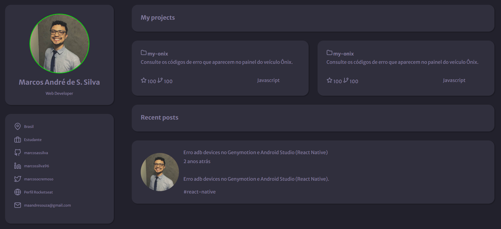

<h1 align="center"> Portfolio </h1>

Este é um dos desafios de HTML e CSS disponíveis na plataforma Rocketseat. 😁  

<a href="https://marcosassilva.github.io/portfolio-rocketseat/">Acesse o projeto aqui!</a>
  

  <a href="#-tecnologias">Tecnologias</a>&nbsp;&nbsp;&nbsp;|&nbsp;&nbsp;&nbsp;
  <a href="#-projeto">Projeto</a>&nbsp;&nbsp;&nbsp;|&nbsp;&nbsp;&nbsp;
  <a href="#-layout">Layout</a>&nbsp;&nbsp;&nbsp;|&nbsp;&nbsp;&nbsp;
  <a href="#memo-licença">Licença</a>

 

  

## 🚀 Tecnologias

Esse projeto foi desenvolvido com as seguintes tecnologias:

- HTML e CSS
- Git e Github
- Figma

## 💻 Projeto

Trata-se de uma página estática com HTML e CSS apresentando portfolio da área de tecnologia.

- [Visite o projeto online](https://marcosassilva.github.io/portfolio-rocketseat/)

## 🔖 Layout

Você pode visualizar o layout do projeto através [DESSE LINK](https://www.figma.com/file/cfmmhAS0bADVljdi3De6xh/DD-%2F-Portfolio-(Copy)?node-id=102%3A2&t=RscZx8JGDwKDzAOP-0). É necessário ter conta no [Figma](https://figma.com) para acessá-lo.

## 📜 Licença

Esse projeto está sob a licença MIT.
